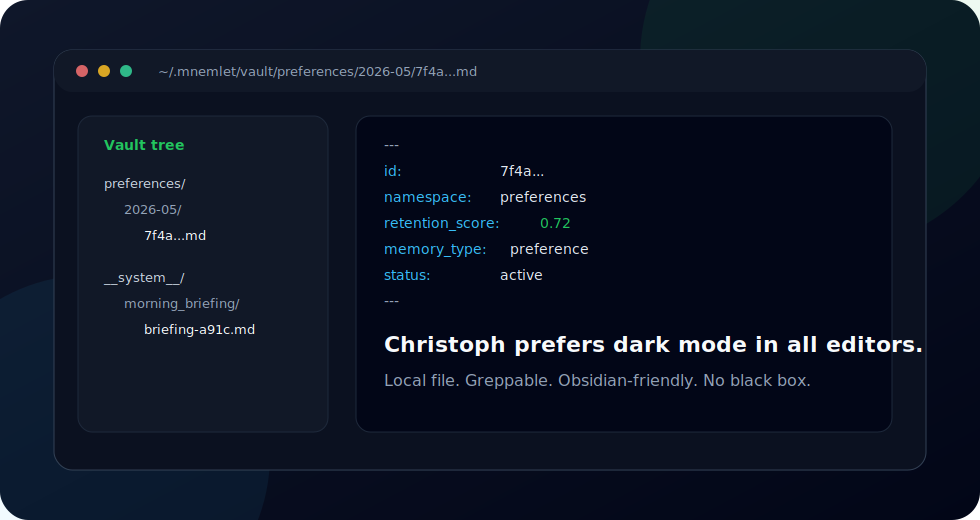

# 🧠 Mnémlet

**Mnémlet is for people who don't want Mem0.** Not because Mem0 is bad software — it's excellent. But because you want your AI's memory to live on your own hardware, not someone else's cloud. You want a system that forgets what doesn't matter instead of hoarding everything forever. You want to open a file on disk and see what your agent actually knows about you. You want zero API bills and full control.

This is a **values** choice, not a feature checklist. If that resonates, welcome.

Built for [r/selfhosted](https://reddit.com/r/selfhosted) and [r/LocalLLaMA](https://reddit.com/r/LocalLLaMA) — people running AI on Pis, homelabs, old laptops, and local servers.

> **Pronounced** `/ˈnɛm.lɛt/` *("NEM-let")* — from Greek *mnēmē* (memory) + *-let* (diminutive: small). The CLI command is `mnemlet` (ASCII), the project name is **Mnémlet**.

[](https://github.com/caugenstein-d/mnemlet)
[](https://pypi.org/project/mnemlet/)
[](https://www.python.org/)
[](LICENSE)
[](https://www.raspberrypi.com/)
[](https://github.com/caugenstein-d/mnemlet/actions/workflows/test.yml)
[](scripts/demo.cast)
[](https://caugenstein-d.github.io/mnemlet)

<p align="center">
  
</p>

---

## What Mnémlet Does

Mnémlet is a self-hosted memory engine for AI agents. It learns what matters, forgets the rest, and consolidates knowledge while you sleep — all on hardware you control.

- 🧠 **Exponential decay + interaction-weighting** — Memories you recall and update stay sharp. What you ignore fades. No infinite hoarding.
- 😴 **Sleep Engine** — Nightly consolidation runs while you're away: deduplicate, rescore stale memories, cluster related knowledge, and generate a morning briefing. Like your brain during REM sleep.
- 🔌 **MCP-native with 16 tools** — `mnemlet_ingest`/`mnemlet_recall`/`mnemlet_search` for the basics, `mnemlet_observe` to feed conversations into the v0.4 extraction pipeline, `mnemlet_context`/`mnemlet_explain` for context packs with provenance, `mnemlet_remember`/`mnemlet_forget`/`mnemlet_replace`/`mnemlet_confirm` for memory review, `mnemlet_audit` for security event inspection, plus `mnemlet_status`/`mnemlet_namespaces`/`mnemlet_update`/`mnemlet_decay_config`/`mnemlet_export` for admin. Works with OpenWebUI, OpenClaw, Claude Code, Cursor, or any MCP client.
- 🛡️ **v0.3 Trust / Security / Privacy** — API-key auth, Secret Guard write protection, sanitized Audit logs, namespace trust policies, and backup/restore for local-first operators.
- 📂 **Inspectable Markdown vault** — Every memory as a `.md` file with YAML frontmatter. Open in Obsidian. `grep` it. `git` it. No black box database lock-in.
- 🤖 **Optional local LLM** — Plug in Gemma3:4b via Ollama. Runs CPU-only on a Pi. Enhances sleep consolidation (contradiction detection, summarization).
- 🔍 **Hybrid search** — BM25 (SQLite FTS5) + vector similarity (ChromaDB). Both local, both free.
- 🥧 **Pi-ready** — 450 MB RAM baseline for core features (decay, sleep, vault, auth). Runs on a Raspberry Pi 5. LLM-powered extraction (v0.4) needs more power — a beefy workstation, remote LLM host, or cloud API.
- 💰 **Zero API costs** — Local ONNX embeddings (all-MiniLM-L6-v2). No OpenAI key, no cloud embedding service, no per-call charges. SearXNG optionally self-hosted for web enrichment.
- 🐍 **Python SDK, REST API, CLI** — `pip install mnemlet`, then `mnemlet serve`. Available on PyPI.

---

## Honest Comparison

No checkmark bingo. Here's where Mnémlet shines, and where it doesn't.

| | [Mnémlet](https://github.com/caugenstein-d/mnemlet) | [Mem0](https://github.com/mem0ai/mem0) | [MemPalace](https://github.com/MemPalace/mempalace) | [Engram](https://github.com/Gentleman-Programming/engram) | [NeoCortex](https://github.com/tinyhumansai/neocortex) |
|---|---|---|---|---|---|
| **Self-hosted** | ✅ | ⚠️ (platform) | ✅ | ✅ | ❌ (API-only) |
| **Decay / Forgetting** | ✅ (deep) | ❌ | ❌ | ❌ | ✅ |
| **Sleep / Consolidation** | ✅ | ❌ | ❌ | ❌ | ❌ |
| **Local LLM support** | ✅ | ❌ | ❌ | ❌ | ❌ |
| **Vector search** | ✅ | ✅ | ✅ | ❌ (FTS5 only) | ✅ |
| **Inspectable vault** | ✅ (Markdown) | ❌ | ❌ | ⚠️ (beta) | ❌ |
| **TUI Dashboard** | ❌ | ❌ | ❌ | ✅ | ❌ |
| **Cloud sync** | ❌ | ✅ | ❌ | ✅ | ✅ |
| **MCP tools** | 16 | ~10 | 29 | 19 | ❌ (API) |
| **Language** | Python | Python | Python | Go | HTTP API |
| **License** | MIT | Apache 2.0 | MIT | MIT | MIT |
| **Pi-friendly RAM** | ✅ (450 MB) | ❌ | ✅ | ✅ | ❌ |

If your priority is cloud sync, a polished dashboard, or an ecosystem with 50k stars — use Mem0 or MemPalace. They're great at those things.

If your priority is **local-first, brain-inspired forgetting, sleep consolidation, and running on hardware you own** — that's the gap Mnémlet fills.

---

## Quickstart

### Install

```bash
pip install mnemlet
```

Or install from source for the latest development version:

```bash
pip install git+https://github.com/caugenstein-d/mnemlet.git
```

### Start the server

For local development you can run without a key while bound to localhost:

```bash
mnemlet serve
# → http://localhost:4050
```

Do not expose a no-key server beyond your own machine.

Recommended setup for daily use:

```bash
mnemlet auth generate-key
export MNEMLET_API_KEY="mnemlet_..."
mnemlet serve
```

### Store your first memory

```bash
curl -X POST http://localhost:4050/api/v1/ingest \
  -H 'Content-Type: application/json' \
  -H "X-Mnemlet-Key: $MNEMLET_API_KEY" \
  -d '{"content":"I prefer dark mode in all editors","namespace":"preferences","importance":0.9}'
```

### Retrieve it

```bash
curl -X POST http://localhost:4050/api/v1/recall \
  -H 'Content-Type: application/json' \
  -H "X-Mnemlet-Key: $MNEMLET_API_KEY" \
  -d '{"query":"editor preferences","namespace":"preferences"}'
```

### Python SDK

Python SDK example is for localhost no-key development only. Authenticated server mode currently needs REST or MCP with `X-Mnemlet-Key`. SDK auth support has not landed yet.

```python
from mnemlet.client import MnemletClient

c = MnemletClient()
c.ingest("Hello world")
results = c.recall("Hello")
print(results)
```

### Connect your agents

Add to any MCP client config:

```json
{"mcpServers": {"mnemlet": {"url": "http://localhost:4050/mcp", "headers": {"X-Mnemlet-Key": "mnemlet_..."}}}}
```

OpenWebUI and OpenCode should pass the same token as `X-Mnemlet-Key` when connecting to REST or MCP. Prefer an environment variable such as `MNEMLET_API_KEY` in the client process or secret store; do not paste real tokens into public configs, screenshots, or issue reports.

### Backup and restore

```bash
mnemlet backup --output ~/mnemlet-backups
mnemlet restore --input ~/mnemlet-backups/mnemlet-backup-...tar.gz --yes
```

Backups include the Markdown vault, SQLite database, Chroma data, and redacted configuration metadata. Stop your server or ensure it is idle before restoring.

---

## Benchmarks

Mnémlet includes a reproducible public benchmark suite with synthetic, commit-safe memory cases.

Run it locally:

```bash
mnemlet benchmark quick --dataset public --output benchmark-results/latest --format json,md,csv
```

The report includes hit@K, MRR, precision@K, false-positive rate, forbidden-hit rate, and latency percentiles. Public claims should cite the dataset, command, environment, and generated report.

Private real-world benchmarks can be stored under `benchmarks/private/`, which is ignored by git.

---

## How It Works

### The Brain Model

Every memory has a `retention_score` (0.0–1.0) that follows exponential decay:

```
score(t) = score₀ × e^(-λ × t)
```

| Memory type | λ value | Half-life |
|---|---|---|
| Preferences / identity | 0.001 | ~2 years |
| Project knowledge | 0.01 | ~69 days |
| Daily chat context | 0.05 | ~14 days |
| Transient / ephemeral | 0.5 | ~1.4 days |

Interactions boost retention: recall +0.15, update +0.20, create +0.10, reference +0.08.

**What this means in practice:**

> Your agent remembers that you prefer dark mode and use Python → these facts have
> high retention, decaying slowly (~2 year half-life). They stay sharp across months
> of sessions without you ever re-stating them.
>
> Your agent quickly forgets that you asked about today's weather or checked a
> one-off API syntax → these are transient memories that fade within days (~1.4 day
> half-life). You never have to manually "clean up" stale context.
>
> When a preference changes — you switch from tabs to spaces — the new memory
> gets a +0.20 update boost, while the old one decays below threshold and moves
> to cold storage. The system self-corrects.

When scores fall below configurable thresholds, memories move to cold storage or get purged.

### The Sleep Engine

After 2 hours of inactivity, Mnémlet enters consolidation. Tasks run sequentially, locally, with zero API costs:

1. **Dedup** — Merge near-duplicate memories created today
2. **Rescore** — Apply time-decay and purge stale memories below threshold
3. **Cluster** — Group semantically similar memories by namespace
4. **Briefing** — Generate a morning context summary for the next session

You can trigger sleep manually via `/api/v1/sleep/start` or check status via `/api/v1/sleep/status`.

### Intelligent Memory Extraction (v0.4, opt-in)

With an LLM enabled, Mnémlet stops hoarding raw chat lines and instead learns from conversations. Messages fed via the `mnemlet_observe` MCP tool are buffered per session; when a session ends (10 min inactivity, a size cap, or shutdown) the LLM **extracts** discrete memories (preferences, facts, decisions, context) and **summarizes** the whole discussion. Platform adapters normalize OpenWebUI, Claude Code, OpenCode, OpenClaw, Cursor, Claude Desktop, and generic MCP clients into one format. The morning briefing is upgraded to a real LLM-written summary.

This is **off by default** — set `[llm].enabled` and `[intelligence].extraction_enabled` to turn it on. `mnemlet_ingest` still stores content immediately and verbatim. See [docs/INTELLIGENT_EXTRACTION.md](docs/INTELLIGENT_EXTRACTION.md).

### Inspectable Vault

```
~/.mnemlet/vault/
  preferences/
    2026-05/
      a1b2c3d4.md          ← Open in Obsidian!
  projects/
    mirofish/
      2026-05/
        e5f6g7h8.md
```

Every memory is a Markdown file with YAML frontmatter. You can read, edit, version-control, or delete memories with any text editor. No black box.

---

## API Reference

| Endpoint | Method | Description |
|---|---|---|
| `/api/v1/health` | GET | Health check |
| `/api/v1/status` | GET | Memory counts, storage stats, decay distribution, security info |
| `/api/v1/vault` | GET | Vault path and file count |
| `/api/v1/memories` | GET | Paginated memory list (`?limit=&offset=&namespace=&sort=&order=`) |
| `/api/v1/memories/{id}` | GET | Single memory with full content, frontmatter, trust, and vault path |
| `/api/v1/ingest` | POST | Store a memory |
| `/api/v1/recall` | POST | Retrieve relevant memories |
| `/api/v1/context` | POST | Build a context pack with abstention reasons |
| `/api/v1/remember` | POST | Store an intelligence memory with classifier policies |
| `/api/v1/forget/{memory_id}` | POST | Soft-forget a memory |
| `/api/v1/replace/{memory_id}` | POST | Replace memory content (preserves provenance) |
| `/api/v1/confirm/{memory_id}` | POST | Confirm a memory (retention boost) |
| `/api/v1/explain/{memory_id}` | GET | Explain a memory's provenance and status |
| `/api/v1/decay/run` | POST | Manual decay run + purge |
| `/api/v1/namespaces/{namespace}/decay` | GET/PUT | Per-namespace decay configuration |
| `/api/v1/sleep/status` | GET | Sleep engine state |
| `/api/v1/sleep/start` | POST | Start sleep cycle manually |
| `/api/v1/sleep/stop` | POST | Stop sleep cycle gracefully |
| `/mcp` | SSE | MCP server endpoint (16 tools) |
| `/ui` | GET | Read-only web dashboard (served without auth; data flows through the protected `/api/v1` endpoints) |

---

## Configuration

```toml
# mnemlet.toml
[server]
host = "127.0.0.1"
port = 4050

[storage]
data_dir = "~/.mnemlet"

[llm]
enabled = false           # Enable for Gemma3:4b via Ollama
provider = "ollama"
model = "gemma3:4b"

[search]
enabled = false           # Enable for SearXNG web enrichment
provider = "searxng"
base_url = "http://localhost:8888"
```

---

## Raspberry Pi

Mnémlet runs on a Raspberry Pi 5. The 16 GB model is recommended if you're running Ollama alongside it.

| Mode | RAM usage |
|---|---|
| Base (no LLM, no search) | ~450 MB |
| + SearXNG | ~650 MB |
| + Gemma3:4b (Ollama) | ~4 GB total |

This is my actual setup: Mnémlet core (decay, sleep, vault, auth) runs on a Pi 5 in my homelab alongside OpenWebUI, OpenCode, and OpenClaw. The v0.4 LLM extraction features are tested and production-ready, but need more RAM/CPU than my Pi provides — so I run them on a separate workstation when I want intelligent extraction.

---

## Why I Built This

I wanted my AI agents to remember context between sessions — my preferences, project details, ongoing conversations. Existing options required cloud accounts, per-request pricing, or opaque storage. I couldn't open a database and see what the system actually knew about me.

So I built something that runs on hardware I own, stores memories as files I can read, and respects the fact that not everything is worth remembering forever.

---

## What Mnémlet Is NOT

- **Not a Mem0 competitor for enterprise teams.** This is a solo tool, built for solo setups. It has single-key local auth, not multi-tenancy, a cloud offering, or VC funding behind it.
- **Not a cloud service.** There is no `app.mnemlet.ai`. There never will be. If you want managed hosting, look at Mem0.
- **Not a production database.** It's AA-battery-grade infrastructure — simple, local, sufficient for one person's context. Don't use it to store customer PII or medical records.
- **Not a replacement for your notes app.** The Markdown vault is inspectable, but it's not designed for manual note-taking. Use Obsidian for that. Use Mnémlet for agent memory.

---

## FAQ

**Why not just use Mem0 self-hosted?**
Mem0 is excellent. But its memory management uses LLM extraction — which costs tokens and discards raw context. Mnémlet stores verbatim content, applies brain-inspired decay *without* LLM calls, and surfaces a human-readable Markdown vault. The Sleep Engine runs on a Pi with zero API costs. If you want managed, production-grade memory with cloud features → Mem0. If you want local, transparent, brain-inspired memory that forgets naturally → Mnémlet.

**Can I use Ollama running on a different host?**
Yes. Set `[llm]` in `mnemlet.toml`: `base_url = "http://192.168.1.100:11434"`. Mnémlet talks to any OpenAI-compatible API, including remote Ollama, LM Studio, or cloud endpoints. Local is just the default.

**What happens to my memories when I update Mnémlet?**
The Markdown vault is forward-compatible — `.md` files don't change format. SQLite migrations run automatically on startup. Internal schema changes are additive (new columns, new tables). If you're paranoid, back up `~/.mnemlet/` before upgrading.

**Can I isolate memories between different AI agents?**
Yes, via namespaces: `/openwebui/christoph/`, `/openclaw/christoph/`, `/shared/`. BUT — this is *organizational* isolation, not *security* isolation. Any MCP client with access to `localhost:4050` can read all namespaces. If you need hard isolation, run separate Mnémlet instances on different ports. See [SECURITY.md](SECURITY.md).

**How do I uninstall Mnémlet cleanly?**
```bash
pip uninstall mnemlet
rm -rf ~/.mnemlet
```
That's it. No system files, no daemons, no databases left behind. We respect your machine.

---

## Maintainer Statement

I maintain this because I believe in the vision: AI memory that's local, transparent, and forgets what doesn't matter. I use the core features daily on my Raspberry Pi — decay, sleep consolidation, the inspectable vault, auth, backup/restore. The v0.4 LLM extraction is tested and works, but needs more power than my current Pi setup provides, so I run it on a separate workstation when I want intelligent conversation extraction.

This is a solo-dev project built on conviction, not daily dogfooding of every feature. Bug reports and pull requests are welcome, but set expectations accordingly.

---

## Roadmap

Honest forward look in [ROADMAP.md](ROADMAP.md). Short version: v0.3 adds the Trust / Security / Privacy layer (auth, audit log, secret guard, backup/restore).

---

## Security

By default, Mnémlet binds to `127.0.0.1` only. Configure `MNEMLET_API_KEY` or `[auth].api_key` for API-key protection with the `X-Mnemlet-Key` header. Secret Guard blocks or warns on configured write-path secret-like content, and the Audit log records sanitized security and review actions. Do not expose Mnémlet directly to the public internet; put any remote access behind your own trusted network boundary.

---

## License

[MIT](LICENSE)

---

*Built with 🧠 on a Raspberry Pi.*
